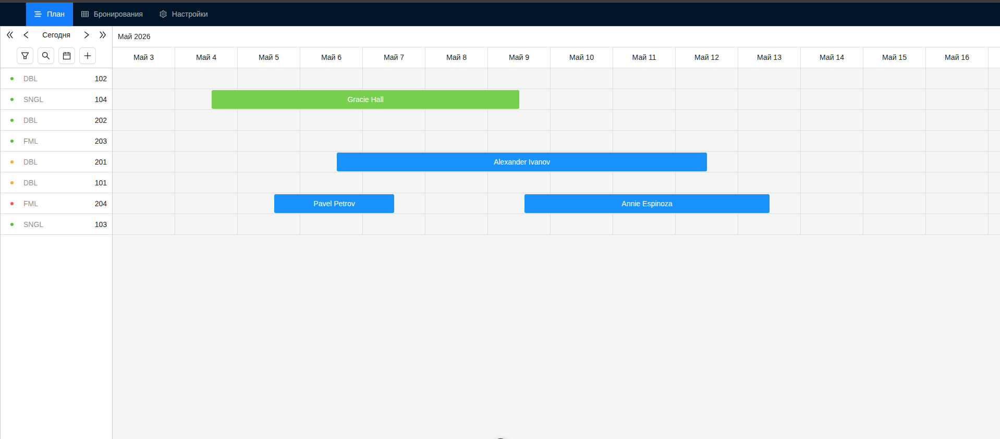
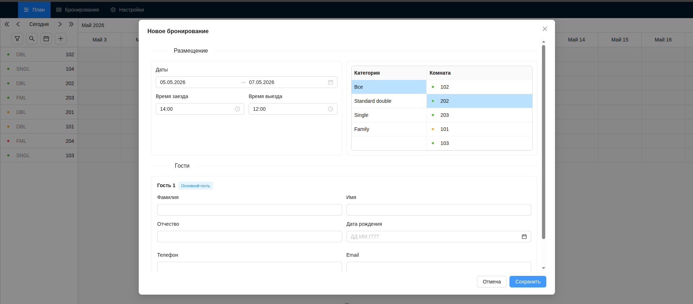

# Hotel Management System

Currently developing with:
- Frontend: Vue 3 + Vite + TypeScript + Ant Design Vue
- Backend: Elysia (Bun) + Postgres + Prisma ORM

## Install

```bash
bun install
```

## Run locally

1. Start backend (port `3000`):

```bash
bun run dev:backend
```

2. Start frontend (port `5173`):

```bash
bun run dev:frontend
```

Frontend calls API at `http://localhost:3000`.

## Database (Prisma)

From `apps/backend`:

```bash
bunx prisma migrate dev
```

## Screenshots




